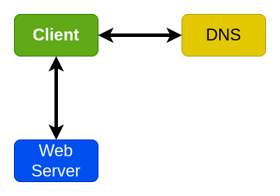
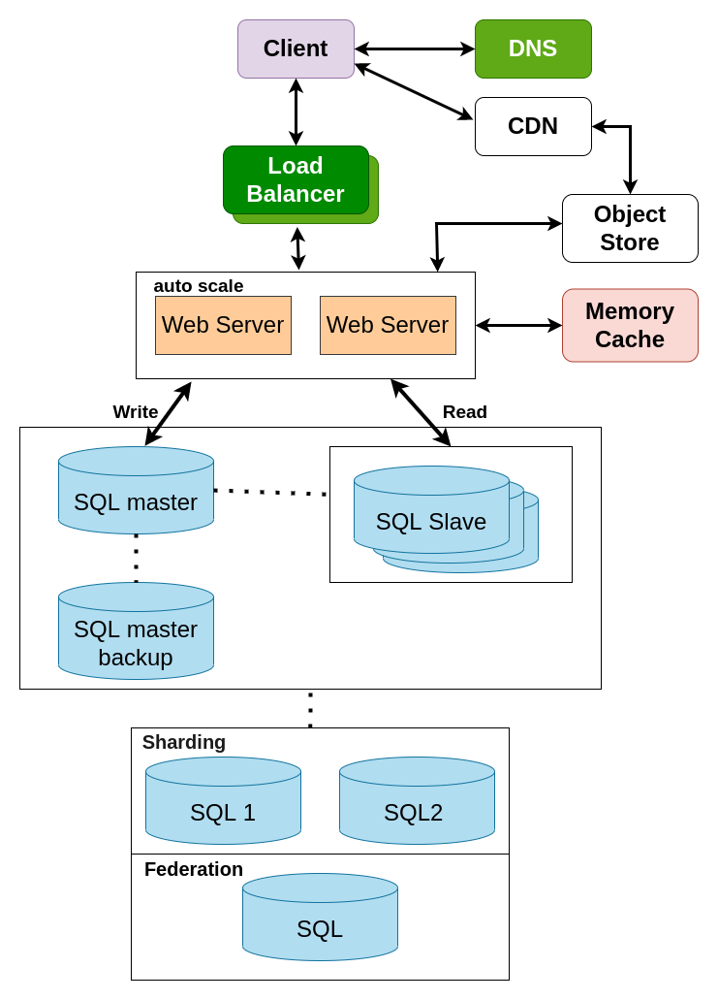

+++
author = "truongnh3"
title = "System Design Project"
date = "2022-05-14"
description = "Bài tập thiết kế hệ thống"
categories = [
    "System Design",
]
tags = [
    "system design",
    "text",
]
image = "system_design.png"
+++

## Đề bài: Thiết kế một hệ thống web blog với khả năng chịu tải 10000 request trên giây.

## Bài làm

### Phát thảo các trường hợp sử dụng và các ràng buộc

#### Trường hợp sử dụng

Ta sẽ giải quyết các trường hợp sau:

- Người dùng thực hiện yêu cầu đọc hoặc ghi
  - Dịch vụ xử lý, lưu trữ dữ liệu người dùng sau đó trả kết quả.
- Dịch vụ cần phát triển từ việc phục vụ một lượng nhỏ người dùng lên hàng triệu người dùng
  - Thảo luận về các mô hình chia tỷ lệ chung khi chúng tôi phát triển một kiến ​​trúc để xử lý một số lượng lớn người dùng và yêu cầu
  - Dịch vụ có tính khả dụng cao
  
#### Hạn chế và giả định

1. Giả định trạng thái
   - Lưu lượng truy cập phân bố không đồng đều.
   - Cần cơ sở dữ liệu quan hệ.
   - Quy mô từ 1 đến hàng triệu người dùng.
   - Biểu thị sự gia tăng của người dùng là:
     - Người dùng +
     - Người dùng ++
     - Người dùng +++
     - ....
   - 1 triệu người dùng.
   - 1 triệu lượt viết mỗi tháng.
   - 500 triệu lượt đọc mỗi tháng
   - Tỷ lệ đọc ghi là: 500 : 1
   - Dung lượng khoảng 500kb
  
2. Tính toán mức sử dụng
    - 476 GB nội dung mỗi tháng.
      - 500 KB * 1000000 lần ghi mỗi tháng.
      - Giả sử hầu hết các bài viết là nội dung mới thay vì cập nhật những nội dung đã có.
    - Trung bình 10 giây thì có 4 lần viết.
    - Trung bình 1 giây thì có 200 lần đọc.
    - 10000 request mỗi giây -> 25000000000 request mỗi tháng.
  
### Thiết kế ở mức cao hơn

### Thiết kế các thanh phần cốt lõi

Người dùng yêu cầu đọc hoặc ghi.

Với số lượng người dùng nhỏ:

- Chỉ cần một Web Server duy nhất.
- Có thể dùng vertical scaling khi cần thiết.
- Giám sát để xử lý hệ thống nếu xảy ra hiện tượng tắt nghẽn.

1. Một Web Server duy nhất:
   - Lưu trữ dữ liệu của người dùng.
   - Xử lý các yêu cầu.
   - Lưu trữ database MySQL.
2. Sử dụng vertical scaling:
   - Đơn giản chỉ cần chọn một hộp lớn hơn
   - Theo dõi các chỉ số để xác định cách mở rộng quy mô
   - Sử dụng giám sát cơ bản để xác định tắc nghẽn: CPU, bộ nhớ, IO, mạng, v.v.
   - Mở rộng quy mô theo chiều dọc có thể rất tốn kém.
   - Không có backup.
3. Cơ sở dữ liệu MySQL:
   - Các ràng buộc cần có cơ sở dữ liệu quan hệ.
   - Dùng MySQL chung trên Web Server.
4. DNS
   - Gán IP của Web Server với một tên miền.
5. Bảo mật Web Server
   - Chỉ mở các cổng cần thiết
     - Cho phép máy chủ web phản hồi các yêu cầu đến từ:
       - 80 cho HTTP
       - 443 cho HTTPS
       - 22 cho SSH đến chỉ các IP có trong danh sách cho phép.
     - Ngăn Web Server có các kết nối ra.

### Mở rộng thiết kế

1. Mở rộng Web Server theo horizontal scaling.
    - Sử dụng nhiều Web Server
    - Thêm các Load Balancer như HAProxy.
    - Mở rộng SQL theo dạng phân tán.
2. Ta sử dụng CDN
    - Sử dụng Object Store để quản lý nội dung tĩnh
      - Khả năng mở rộng cao và đáng tin cậy
      - Mã hóa phía máy chủ
    - Di chuyển các nội dung tĩnh vào đây:
      - User file
      - JS
      - CSS
      - Hình ảnh
      - Video
3. Thêm một Memory Caching (Redis)
    - Data được truy cập thường xuyên từ database.
    - Data session từ Web Server.
4. Mở rộng Database
    - Chỉ lưu trữ dữ liệu trong một khoảng thời gian giới hạn trong cơ sở dữ liệu, trong khi lưu trữ phần còn lại trong một kho dữ liệu chẳng hạn như Redshift
      - Một kho dữ liệu như Redshift có thể thoải mái xử lý giới hạn 1 TB nội dung mới mỗi tháng
    - Với 200 yêu cầu đọc trung bình mỗi giây, lưu lượng đọc cho nội dung phổ biến có thể được giải quyết bằng cách mở rộng Bộ nhớ cache , điều này cũng hữu ích để xử lý lưu lượng truy cập được phân bổ không đồng đều và lưu lượng truy cập tăng đột biến
5. Bảo mật hệ thống
    - Mã hóa dữ liệu khi chuyển tiếp và ở trạng thái nghỉ
    - Sử dụng VPC(Virtual Private Cloud)
      - Tạo một mạng con công cộng cho Web Server duy nhất để nó có thể gửi và nhận lưu lượng truy cập từ internet
      - Tạo một mạng con riêng cho mọi thứ khác, ngăn chặn sự truy cập từ bên ngoài
      - Chỉ mở các cổng từ các IP có trong danh sách cho phép cho phép  

Sắp tới mình sẽ có một bản demo về vấn đề này ở [**link này**](https://github.com/truongnh28). Mình sẽ cố gắng cập nhật sớm nhất.

## Kết luận

Trên đây chỉ là hiểu biết của mình thông qua việc tìm hiểu module System Design, bản thân mình cũng hi vọng nhận được sự những chia sẻ cũng như thảo luận từ phía các bạn để hoàn thiện hơn. Xin cảm ơn.

## Tham khảo

[system-design-primer](https://github.com/donnemartin/system-design-primer)



