+++
author = "truongnh3"
title = "Class diagram UML"
date = "2022-05-14"
description = "note class diagram"
categories = [
    "UML",
]
tags = [
    "UML",
    "text",
]
image = "p18.png"
+++

# Class diagram

## Giới thiệu

Sơ đồ lớp (UML) là một ký hiệu đồ họa sử dụng để trực quan hóa các hệ thống hướng đối tượng. Sơ đồ lớp trong UML là một loại sơ đồ cấu trúc tĩnh mô tả cấu trúc của hệ thống bằng cách hiển thị các thành phần của các thành phần hệ thống:

- Các lớp
- Các thuộc tính của lớp.
- Các phương thức của lớp.
- Các quan hệ giữa các đối tượng.
  
## Class là cái vẹo gì?

Class là một bản thiết kế cho một đối tượng. Các đối tượng và class luôn đi đôi với nhau. Chúng ta không thể nói cái này mà không có cái kia. Và toàn bộ điểm của thiết kế hướng đối tượng không phải nói đến các đối tượng mà nó nói đến class bởi vì chúng ta sử dụng class để tạo ra các đối tượng. Nên một class sẽ mô tả một đối tượng nó như thế nào nhưng bản thân của class không phải là một đối tượng.

Trong thực tế, các class mô tả các kiểu của đối tượng, trong khi các đối tượng là thể hiện của các class. Mỗi đối tượng được xây dựng từ các bản thiết kế do đó nó chứa các phương thức và thuộc tính giống nhau. Ý nghĩa tiêu chuẩn là một đối tượng là một thể hiện của một lớp và các đối tượng có trạng thái và hành vi. 

Ví dụ:

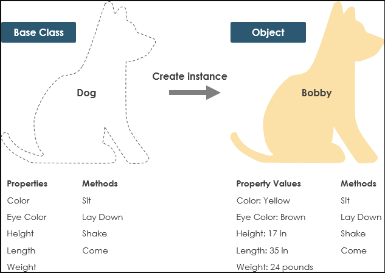

## Ký hiệu của UML Class

Một class đại diện cho một khái niệm bao gồm thuộc tính (attributes) và hành vi(behavior). Mỗi thuộc tính có một kiểu và một hành vi mỗi hành vi có một chữ ký. Tên lớp là thông tin bắt buộc duy nhất.

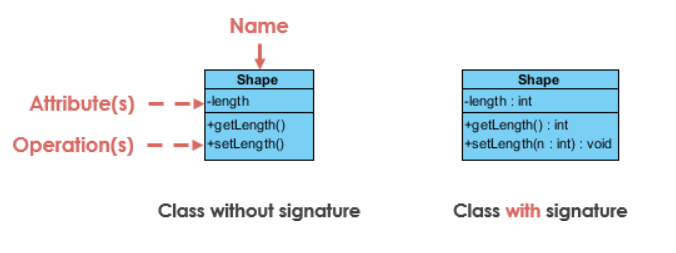

- Tên lớp:
  - Tên của lớp xuất hiện trong phân vùng đầu tiên.
- Thuộc tính lớp(Attributes):
  - Các thuộc tính được hiển thị trong phân vùng thứ hai.
  - Loại thuộc tính được hiển thị sau dấu hai chấm.
  - Các thuộc tính ánh xạ lên các biến thành viên (thành viên dữ liệu) trong mã.
- Hoạt động lớp(Operations) (Phương thức):
  - Các hoạt động được hiển thị trong phân vùng thứ ba. Chúng là những dịch vụ mà lớp học cung cấp.
  - Kiểu trả về của một phương thức được hiển thị sau dấu hai chấm ở cuối chữ ký phương thức.
  - Kiểu trả về của các tham số phương thức được hiển thị sau dấu hai chấm theo sau tên tham số. Các phép toán ánh xạ vào các phương thức lớp trong code.

    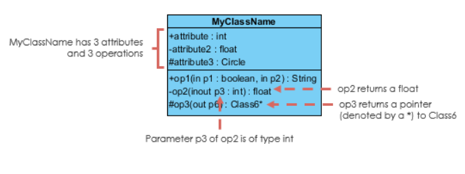

1. Class Visibility

    Các ký hiệu +, - và # trước tên thuộc tính và hoạt động trong một lớp biểu thị khả năng hiển thị của thuộc tính và hoạt động.

    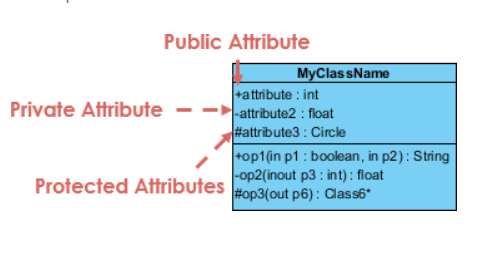

    - "+" biểu thị các thuộc tính hoặc hoạt động public
    - "-" biểu thị các thuộc tính hoặc hoạt động private
    - "#" biểu thị các thuộc tính hoặc hoạt động protected

2. Parameter Directionality

    Mỗi tham số trong một hoạt động (phương thức) có thể được ký hiệu là in, out hoặc inout, chỉ định hướng của nó đối với người gọi. Hướng này được hiển thị trước tên tham số.

    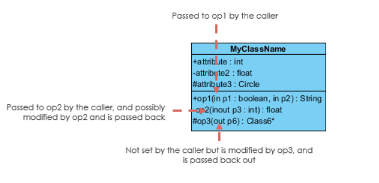

## Perspectives of Class Diagram

Việc lựa chọn quan điểm phụ thuộc vào việc bạn đã đi được bao xa trong quá trình phát triển. Ví dụ, trong quá trình xây dựng **domain model**, bạn sẽ hiếm khi vượt qua **conceptual perspective**. **Analysis models** thường sẽ có sự kết hợp giữa **conceptual and specification perspectives**. Việc phát triển **Design model** thường sẽ bắt đầu với sự nhấn mạnh nhiều vào **specification perspective**, và phát triển thành **implementation perspective**.

Một sơ đồ có thể được giải thích từ nhiều khía cạnh khác nhau:

- Conceptual(Khái niệm): đại diện cho các khái niệm trong miền
- Specification(Đặc điểm kỹ thuật): tập trung vào các giao diện của Kiểu dữ liệu trừu tượng (ADT) trong phần mềm
- Implementation(Triển khai): mô tả cách các lớp sẽ triển khai các giao diện của chúng

Quan điểm ảnh hưởng đến số lượng chi tiết được cung cấp và các loại mối quan hệ đáng trình bày. Như chúng tôi đã đề cập ở trên, tên lớp là thông tin bắt buộc duy nhất.

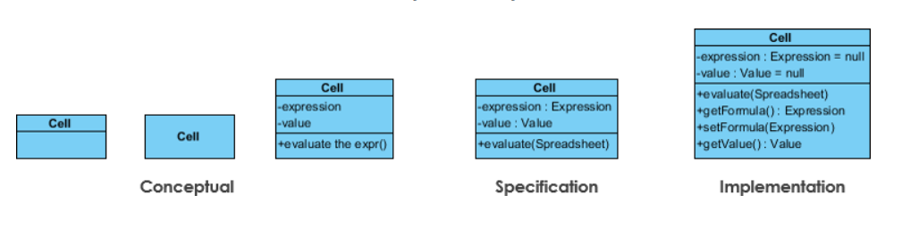

## Mối quan hệ giữa các lớp

UML không chỉ là về những bức ảnh đẹp. Nếu được sử dụng đúng cách, UML sẽ truyền tải chính xác cách mà code nên được triển khai từ các sơ đồ. Nếu được diễn giải chính xác, code được triển khai sẽ phản ánh đúng ý định của nhà thiết kế. Bạn có thể mô tả ý nghĩa của từng mối quan hệ so với ngôn ngữ lập trình mục tiêu của bạn được hiển thị trong Hình bên dưới không?

Nếu bạn vẫn chưa thể nhận ra chúng, không có vấn đề gì phần này nhằm giúp bạn hiểu các mối quan hệ lớp UML. Một lớp có thể tham gia vào một hoặc nhiều mối quan hệ với các lớp khác. Mối quan hệ có thể là một trong các loại sau:

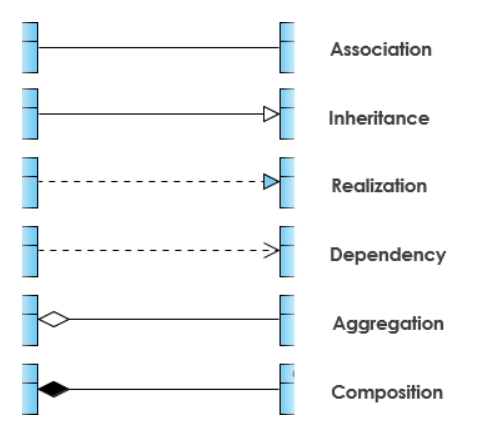

### Inheritance (or Generalization) (Kế thừa (hoặc Tổng quát))

Tổng quát hóa là một mối quan hệ phân loại giữa một bộ phân loại tổng quát hơn và một bộ phân loại cụ thể hơn. Mỗi thể hiện của trình phân loại cụ thể cũng là một thể hiện gián tiếp của trình phân loại chung. Do đó, trình phân loại cụ thể kế thừa các tính năng của trình phân loại tổng quát hơn.

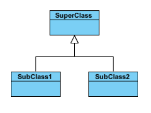

Ví dụ:
Hình dưới đây cho thấy một ví dụ kế thừa với hai kiểu. Mặc dù các đầu nối được vẽ khác nhau nhưng chúng tương đương nhau về mặt ngữ nghĩa.

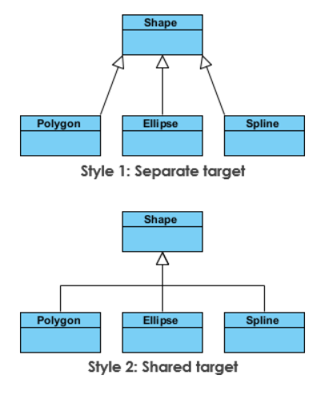

### Association (Sự kết hợp)

Liên kết là mối quan hệ giữa các lớp trong một Sơ đồ lớp UML. Chúng được biểu diễn bằng một đường liền nét giữa các lớp. Các liên kết thường được đặt tên bằng cách sử dụng một động từ hoặc cụm động từ phản ánh lĩnh vực vấn đề trong thế giới thực.

a. Hiệp hội đơn giản

- Một liên kết cấu trúc giữa hai lớp đồng đẳng.
- Có sự liên kết giữa Class1 và Class2

Hình dưới đây cho thấy một ví dụ về liên kết đơn giản. Có một liên kết kết nối lớp <<control>> lớp Class1 và lớp <<boundary>> lớp Class2. Mối quan hệ được hiển thị như một đường liền mạch nối hai lớp.

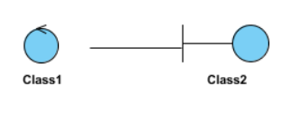

b. Cardinality

Cardinality được thể hiện dưới dạng:

- Một - Một
- Một - Nhiều
- Nhiều - Nhiều.
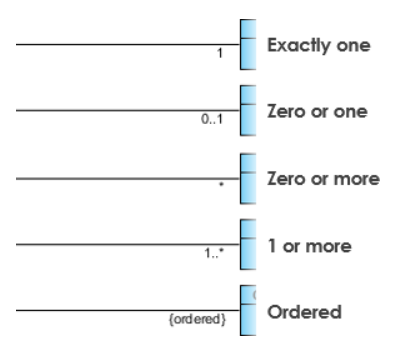

### Aggregation (Tổng hợp)

Một kiểu liên kết đặc biệt.

- Nó đại diện cho một mối quan hệ "một phần của".
- Class2 là một phần của Class1.
- Nhiều phiên bản (ký hiệu là *) của Class2 có thể được liên kết với Class1.
- Các đối tượng của Class1 và Class2 có vòng đời riêng biệt.

Hình dưới đây cho thấy một ví dụ về tập hợp. Mối quan hệ được hiển thị dưới dạng một đường liền nét với một viên kim cương chưa được lấp đầy ở đầu kết hợp, được kết nối với lớp đại diện cho tổng thể.
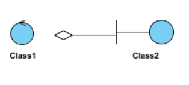

### Composition (Hợp thành)

- Một kiểu tập hợp đặc biệt mà các bộ phận bị phá hủy khi toàn bộ bị phá hủy.
- Các đối tượng của Class2 sống chết với Class1.
- Class2 không thể tự đứng.

Hình dưới đây cho thấy một ví dụ về bố cục. Mối quan hệ được hiển thị dưới dạng một đường liền nét với một viên kim cương được lấp đầy ở đầu kết hợp, được kết nối với lớp đại diện cho toàn bộ hoặc kết hợp.
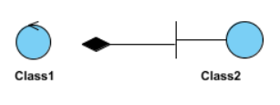

### Dependency (Sự phụ thuộc)

Một đối tượng của một lớp có thể sử dụng một đối tượng của lớp khác trong mã của một phương thức. Nếu đối tượng không được lưu trữ trong bất kỳ trường nào, thì đối tượng này được mô hình hóa như một mối quan hệ phụ thuộc.

- Một kiểu liên kết đặc biệt.
- Tồn tại giữa hai lớp nếu những thay đổi đối với định nghĩa của một lớp có thể gây ra những thay đổi cho lớp kia (nhưng không phải ngược lại).
- Class1 phụ thuộc vào Class2

Hình dưới đây cho thấy một ví dụ về sự phụ thuộc. Mối quan hệ được hiển thị dưới dạng đường đứt nét với một mũi tên mở.
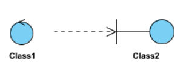
Hình dưới đây cho thấy một ví dụ khác về sự phụ thuộc. Lớp Person có thể có phương thức hasRead với tham số Book trả về true nếu người đó đã đọc sách (có thể bằng cách kiểm tra một số cơ sở dữ liệu).
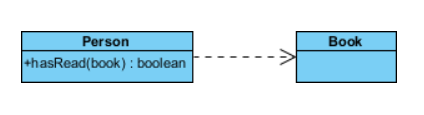

### Realization (Hiện thực hóa)

Hiện thực hóa là một mối quan hệ giữa lớp kế hoạch chi tiết và đối tượng chứa các chi tiết mức độ thực thi tương ứng của nó. Đối tượng này được cho là nhận ra lớp kế hoạch chi tiết. Nói cách khác, bạn có thể hiểu đây là mối quan hệ giữa interface và lớp thực thi.

Ví dụ: giao diện Chủ sở hữu có thể chỉ định các phương pháp mua tài sản và định đoạt tài sản. Các lớp Person và Corporation cần triển khai các phương thức này, có thể theo những cách rất khác nhau.
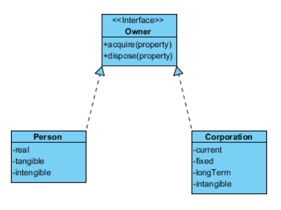
Ví dụ: Sơ đồ lớp Hệ thống đặt hàng.
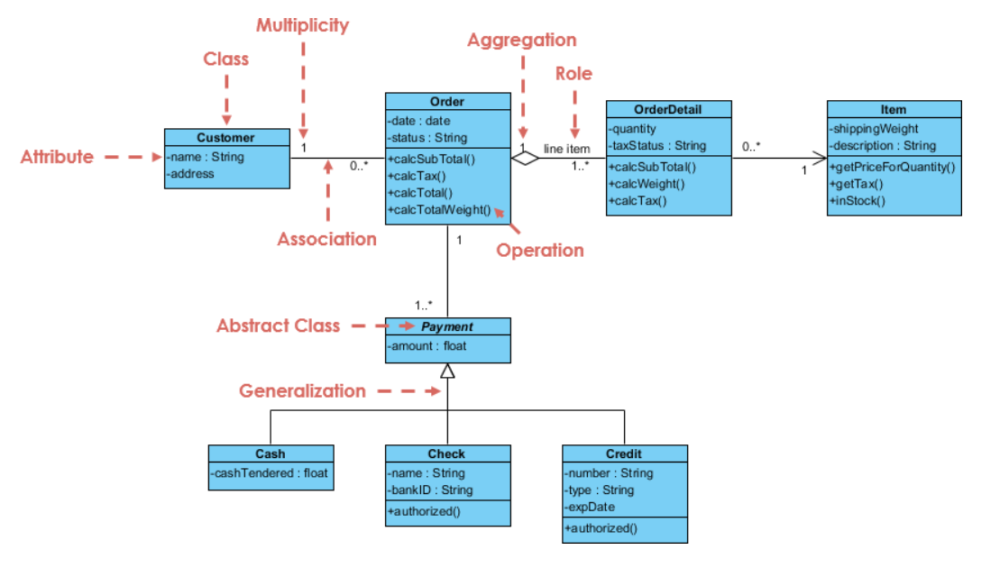
Ví dụ: Sơ đồ lớp: GUI
Sơ đồ lớp cũng có thể có các ghi chú đính kèm với các lớp hoặc các mối quan hệ.
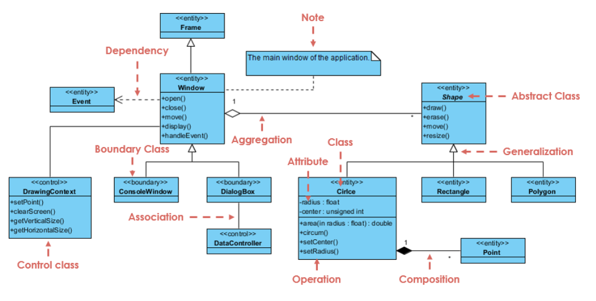

## Tham khảo

[visual-paradigm](https://www.visual-paradigm.com/guide/uml-unified-modeling-language/uml-class-diagram-tutorial/)

